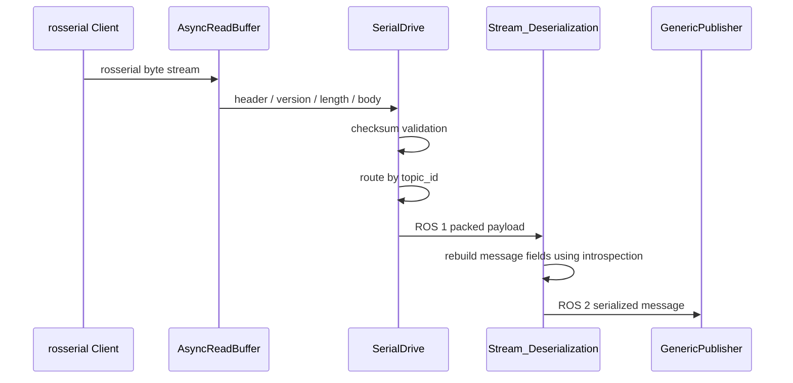
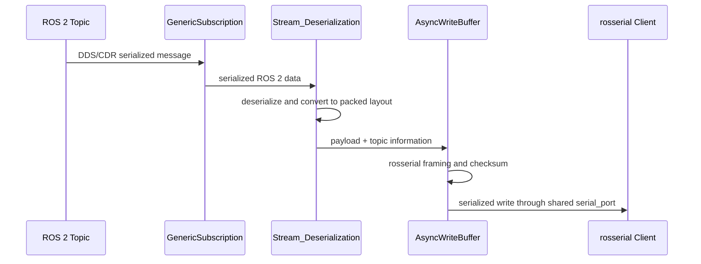

# rosserial_ros2


兼容 rosserial 客户端的 ROS 2 服务端实现。

该项目在 ROS 2 中实现 rosserial 服务端所需的串口传输、协议解析、动态话题注册和消息格式转换，使已有设备端 rosserial 客户端能够接入 ROS 2 系统，而无需修改其基本通信流程。

> 当前项目处于开发阶段，已完成 Topic 通信主链路；Service、Action 和进一步的并发性能优化仍在实现中。

## 项目目标

rosserial 客户端发送的是基于 ROS 1 消息定义的紧密序列化数据，而 ROS 2 通信基于 DDS/CDR，并通过运行时类型支持完成消息的创建、序列化和发布。

本项目处理以下转换链路：

```text
设备端 rosserial 客户端
        │
        │ 串口 / rosserial 数据包
        ▼
异步传输层
        │
        ▼
协议解析与 Topic 注册
        │
        ▼
ROS 1 紧密序列化数据 ⇄ ROS 2 消息内存表示 ⇄ DDS/CDR
        │
        ▼
ROS 2 GenericPublisher / GenericSubscription
```

项目只实现服务端与适配层，设备端继续使用兼容 rosserial 协议的客户端。

## 当前功能

-  基于 Boost.Asio 的异步串口读写
-  rosserial 包头、版本、长度、Topic ID、数据体和校验和解析
-  根据注册信息动态创建 ROS 2 Publisher 和 Subscription
-  rosserial 紧密序列化数据到 ROS 2 消息的转换与发布
-  ROS 2 序列化消息到 rosserial 数据包的转换与回写
-  运行时修改串口端口和波特率，并重新初始化串口
- 多个订阅回调共享串口时的写入串行化
### 待实现
-  Service 通信
-  Action 通信
-  多线程执行与性能优化

## 系统架构

```text
┌──────────────────────────────────────────────────────────────┐
│                         SerialNode                           │
│  ROS 2 参数、定时器、节点生命周期                            │
└───────────────────────────┬──────────────────────────────────┘
                            │ owns
                            ▼
┌──────────────────────────────────────────────────────────────┐
│                        SerialDrive                           │
│  串口生命周期、协议读取状态、Topic 注册、消息路由             │
└───────────────┬──────────────────────────────┬───────────────┘
                │                              │
                ▼                              ▼
┌──────────────────────────┐      ┌────────────────────────────┐
│       transport          │      │        ros_adapter         │
│                          │      │                            │
│  AsyncReadBuffer         │      │  Stream_Deserialization    │
│  AsyncWriteBuffer        │      │  Serial_Publisher          │
│  Boost.Asio serial_port  │      │  Serial_Subscriber         │
└───────────────┬──────────┘      └──────────────┬─────────────┘
                │                                │
                ▼                                ▼
┌──────────────────────────┐      ┌────────────────────────────┐
│        protocol          │      │          ROS 2             │
│                          │      │                            │
│  Ros_Stream              │      │  GenericPublisher          │
│  Write_Buffer            │      │  GenericSubscription       │
│  checksum / packet       │      │  introspection typesupport │
└──────────────────────────┘      └────────────────────────────┘
```

模块之间按职责划分：

- `SerialNode` 负责 ROS 2 节点生命周期、参数声明和定时调度，不直接处理串口数据。
- `SerialDrive` 组织串口会话和协议处理流程，并根据注册包创建对应的话题对象。
- `transport` 封装异步读写与缓冲区，不感知 ROS 消息类型。
- `protocol` 处理字节流、校验和与紧密序列化数据。
- `ros_adapter` 通过 ROS 2 运行时类型支持完成动态消息转换和话题接入。

## 数据处理流程

### 串口到 ROS 2



读取流程由多个异步阶段组成：

```text
start_read()
  └─ read_async_head()
       └─ read_async_first()
            └─ read_async_second()
                 └─ read_length()
                      └─ read_body()
```

每个阶段只处理当前协议字段。校验失败或包头不匹配时，读取流程重新寻找下一处有效数据包起点，避免将一次异常扩散到后续数据。

注册包建立 `topic_id` 与处理对象之间的映射。后续收到普通数据包时，`SerialDrive` 根据 `topic_id` 找到对应回调，将数据交给动态发布器处理。

### ROS 2 到串口



`Serial_Subscriber` 由 ROS 2 订阅回调驱动。收到消息后，适配层将 ROS 2 消息转换为 rosserial 紧密序列化格式，再由 `AsyncWriteBuffer` 完成协议封装和串口写入。

## 关键实现

### 1. ROS 2 Executor 与 Boost.Asio 协同

`SerialDrive` 使用 Boost.Asio 管理异步串口操作。为了让 Asio 回调与 ROS 2 节点在同一执行流程中推进，节点定时调用 I/O 调度函数，并通过 `poll_one()` 分批执行就绪回调。

单次调度设置回调处理上限，避免串口事件持续占用执行线程，影响 ROS 2 参数回调和其他节点任务。

### 2. 分阶段协议解析

协议解析没有一次性假设完整数据包已经到达，而是按包头、协议版本、长度、Topic ID 和数据体逐段读取。每个异步回调只在前一阶段校验通过后继续。

该设计同时处理：

- 串口数据分段到达；
- 一次读取包含多个包的部分数据；
- 数据包头错位；
- 长度与数据校验失败；
- 后续读取需要复用缓冲区剩余数据。

### 3. 带缓存的异步读取

`AsyncReadBuffer` 在串口读取和上层定长请求之间维护缓存。当缓存数据不足时才发起新的异步读取；数据足够后，将上层要求的字节数交给对应回调，其余数据继续保留给下一次协议解析。

这使协议层可以按字段请求固定长度的数据，而不依赖底层串口每次返回的实际字节数。

### 4. 运行时消息类型适配

节点在编译时不需要预先确定所有 Topic 类型。

注册阶段根据 `TopicInfo` 中的消息类型信息获取 ROS 2 introspection typesupport 和序列化相关句柄，并使用 `GenericPublisher` 或 `GenericSubscription` 创建运行时话题对象。

`Stream_Deserialization` 负责两种表示之间的转换：

```text
rosserial / ROS 1 packed layout
                ⇅
ROS 2 message field layout
                ⇅
DDS/CDR serialized data
```

字段读写使用消息成员描述信息推进数据指针。对平凡类型和数组使用 `memcpy()`，避免直接对未对齐字节地址进行类型解引用。

### 5. 动态 Topic 注册与路由

收到客户端注册信息后，`SerialDrive` 按注册类型创建：

- `Serial_Publisher`：串口侧收到对应 `topic_id` 的数据后，转换并发布到 ROS 2；
- `Serial_Subscriber`：ROS 2 侧收到消息后，转换、封包并写回串口。

话题名称和消息类型由客户端注册信息决定，不需要在服务端为每种消息编写独立 Publisher 或 Subscription。

### 6. 并发写入控制

多个 ROS 2 Subscription 回调可能同时向同一个串口发送数据。`AsyncWriteBuffer` 对共享写缓冲区进行互斥保护，并保持同一时刻只有一个实际串口写操作处于进行状态。

新的数据在已有写操作进行时进入待发送缓冲区，而不是直接并发调用底层串口，从而避免多个 rosserial 数据包在字节级交错。

### 7. 对象所有权

主要对象关系如下：

```text
SerialNode
  ├─ unique ownership ──> SerialDrive
  └─ shared ownership ──> Serial_Config
                              ▲
                              │
                         SerialDrive
```

- `SerialNode` 唯一持有 `SerialDrive`，避免多个节点实例同时控制同一会话对象。
- `SerialNode` 与 `SerialDrive` 共享串口配置，参数更新后双方读取同一份状态。
- `SerialDrive` 对节点只保留非拥有型引用，不参与节点析构。

## 目录结构

```text
src/
├── rosserial_msg/
│   └── msg/
│       └── TopicInfo.msg
│
└── rosserial_server/
    ├── session/
    │   └── serial_session.hpp
    ├── transport/
    │   └── async_transport.hpp
    ├── protocol/
    │   ├── message_serialization.hpp
    │   └── serial_stream.hpp
    ├── ros_adapter/
    │   ├── ros_message_adapter.hpp
    │   └── topic_handle.hpp
    └── serial_node.cpp
```

## 主要类

| 类 | 职责 |
|---|---|
| `SerialNode` | ROS 2 节点入口、参数声明、定时器和生命周期管理 |
| `SerialDrive` | 串口会话、协议读取状态、Topic 注册与数据路由 |
| `Serial_Config` | 在节点和串口会话之间共享端口及波特率配置 |
| `AsyncReadBuffer` | 异步读取、剩余数据缓存和定长数据交付 |
| `AsyncWriteBuffer` | 协议封包、发送缓冲和共享串口写入串行化 |
| `Ros_Stream` | 对串口字节流提供带边界的顺序读取接口 |
| `Write_Buffer` | 构造 rosserial 紧密序列化数据 |
| `Stream_Deserialization` | ROS 1 紧密格式与 ROS 2 消息表示之间的转换 |
| `Serial_Publisher` | 将串口数据转换为 ROS 2 Topic 消息 |
| `Serial_Subscriber` | 将 ROS 2 Topic 消息转换为 rosserial 数据包 |

## 构建环境

- ROS 2 Humble
- C++14
- Boost.Asio
- `colcon`
- `rosdep`

## 构建

```bash
git clone <repository-url> rosserial_ros2
cd rosserial_ros2

rosdep install --from-paths src --ignore-src -r -y
colcon build --symlink-install

source install/setup.bash
```

## 运行

```bash
ros2 run rosserial_server serial_node
```

指定串口参数：

```bash
ros2 run rosserial_server serial_node \
  --ros-args \
  -p port:=/dev/ttyUSB0 \
  -p baud:=115200
```

运行期间修改参数：

```bash
ros2 param set /serial_node port /dev/ttyUSB1
ros2 param set /serial_node baud 921600
```

参数回调会检查新值，并在配置有效时重新初始化串口。

> 实际节点名、参数默认值和串口权限要求以当前代码及 launch 配置为准。

## 验证建议

启动节点后，可以按以下顺序检查通信链路：

```bash
# 查看节点和参数
ros2 node list
ros2 param list /serial_node

# 查看客户端注册后创建的话题
ros2 topic list
ros2 topic info <topic-name>

# 观察串口客户端发布到 ROS 2 的数据
ros2 topic echo <topic-name>

# 从 ROS 2 向串口客户端发送数据
ros2 topic pub <topic-name> <message-type> '<message-data>'
```


## 后续计划

1. 补充 Service 和 Action 的注册及数据转换流程；
2. 完善不同基础类型、数组、字符串和嵌套消息的兼容性测试；
3. 增加协议异常、校验失败和串口重连测试；
4. 评估 MultiThreadedExecutor 下的回调调度与写缓冲策略；
5. 增加 CI 构建和自动化测试。

## 与 rosserial 的关系

本项目是兼容 rosserial 通信协议和客户端行为的 ROS 2 服务端实现，不是 rosserial 官方发行版本，也不隶属于或代表 ROS、Open Robotics 或 rosserial 维护者。

## License

本项目采用 [BSD-3-Clause](LICENSE) 许可证。
